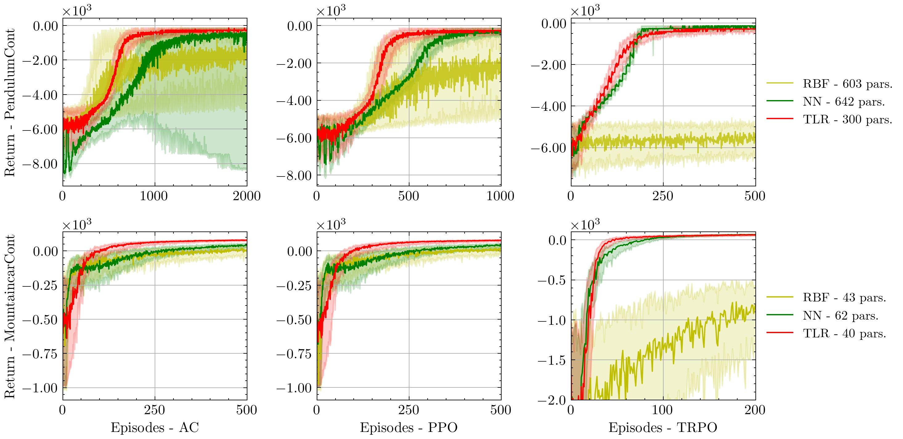

# Multilinear Tensor Low-Rank Approximation for Policy-Gradient Methods in Reinforcement Learning

by
Sergio Rozada,
Hoi-To Wai,
and Antonio G. Marques,

This code belongs to a paper that has been submitted for publication in *IEEE Transactions on Signal Processing*.

## TLDR

> This paper proposes tensor low-rank policies using PARAFAC decomposition to improve RL efficiency, reducing computational and sample complexities compared to neural networks.

    

## Abstract

> Reinforcement learning (RL) aims to estimate the action to take given a (time-varying) state, with the goal of maximizing a cumulative reward function. Predominantly, there are two families of algorithms to solve RL problems: value-based and policy-based methods, with the latter designed to learn a probabilistic parametric policy from states to actions. Most contemporary approaches implement this policy using a neural network (NN). However, NNs usually face issues related to convergence, architectural suitability, hyper-parameter selection, and underutilization of the redundancies of the state-action representations (e.g. locally similar states). This paper postulates multi-linear mappings to efficiently estimate the parameters of the RL policy. More precisely, we leverage the PARAFAC decomposition to design tensor low-rank policies. The key idea involves collecting the policy parameters into a tensor and leveraging tensor-completion techniques to enforce low rank. We establish theoretical guarantees of the proposed methods for various policy classes and validate their efficacy through numerical experiments. Specifically, we demonstrate that tensor low-rank policy models reduce computational and sample complexities in comparison to NN models while achieving similar rewards.

## Software implementation

All source code used to generate the results and figures in the paper are in the `src` folder. The calculations and figure generation are all done by running:
* `main.py`: Runs all the experiments, stores the data, and plots the figures.

Results generated by the code are saved in `results`, and figures are saved in `figures`.

## Getting the code

You can download a copy of all the files in this repository by cloning the
[git](https://github.com/sergiorozada12/tensor-low-rank-pg) repository:

    git clone https://github.com/sergiorozada12/tensor-low-rank-pg.git

or [download a zip archive](https://github.com/sergiorozada12/tensor-low-rank-pg/archive/refs/heads/main.zip).

## Dependencies

You'll need a working Python environment to run the code.
The recommended way to set up your environment is through [virtual environments](https://docs.python.org/3/library/venv.html). The required dependencies are specified in the file `requirements.txt`.
